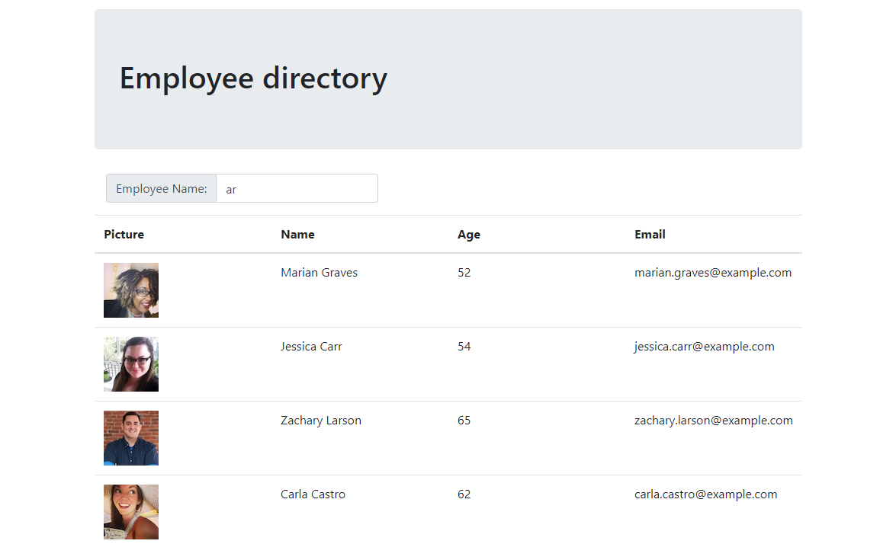

# React Employee Directory
Project for UC Berkeley coding Bootcamp

[](https://opensource.org/licenses/MIT)



## Technologies Used
- HTML
- CSS
- JavaScript
- [React](https://reactjs.org/)
- [Node.js](https://nodejs.org/en/)
- [npm](https://www.npmjs.com/) packages
    - [Axios](https://www.npmjs.com/package/axios)
    - [react-bootstrap](https://www.npmjs.com/package/react-bootstrap)
    - [react-bootstrap-table-next](https://www.npmjs.com/package/react-bootstrap-table-next)
    - [React-dom](https://www.npmjs.com/package/react-dom)


## Summary 
In this App, you will be able to view informations about a random Employee Database, but also sort and filter the results.

## How to install
Have node installed on you machine then run the command :

```
npm install
```

## How to use it

run the commande 

```
npm start then browse http://localhost:3000
```

## Code Snippet  
```Javascript 
  searchEmployee = () => {
    API.search()
      .then(res => {
        const newData = [];
        console.log(res.data);
        res.data.results.forEach((data)=>{
          newData.push({
            picture: [data.picture.medium, data.name.first],
            name: data.name.first + " " + data.name.last,
            age: data.dob.age,
            email: data.email
          });
        });
        this.setState({ results: newData })
        this.setState({ filtered: newData })
      })
      .catch(err => console.log(err));
  };
```
In this function, I populated a new Array of object filtering only the data I needed from the Api call.

## Deployed Link

[See Live Site](https://dylancouzon.github.io/React-EmployeeDirectory/)


## Author Links
[LinkedIn](https://www.linkedin.com/in/dcouzon/)
[GitHub](https://github.com/Dylancouzon)
